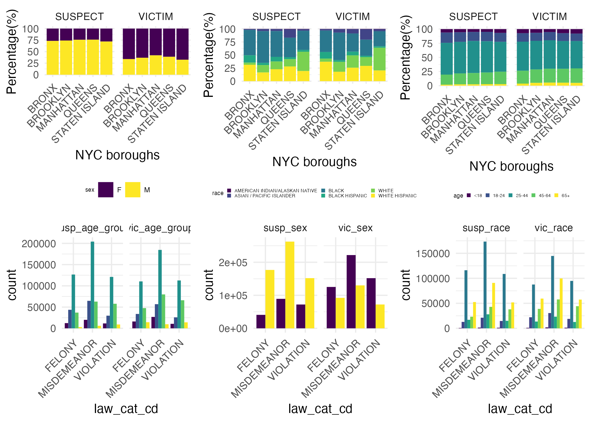

# Motivation
  As students living in NYC, we wanted to create a comprehensive analysis of crime and safety in NYC. The goals of this project were to use a NYPD data from 2006-2019 to provide a multi-dimensional view of crime incidents in NYC. Particularly, we analyzed patterns of crime events, characteristics of suspects & victims, and socioeconomic indicators. By doing so, we hoped to identify trends that may inform better safety measures and law enforcement strategies.  

# Related Work
  A few things inspired this project. Firstly, we think our lived experiences in NYC and wanting to engage with the city while still remaining safe was a leading factor. From the increased prevalence of cops on subways to news surrounding the spike in crimes in NYC post-COVID-19, we thought that it was important to understand more concretely what key factors contributed to crime and safety. Moreover, I think another inspiration for this were the methods we learned in class to visualize data in a variety of ways, including maps and geospatial figures. We were eager to understand the differences by borough and neighborhood, and tease apart nuances that may be lost when reading headlines from the news. 

# Initial Questions 
  Our intial plan for the data was to divide the large dataset into 3 key parts: general crime data, suspect and victim analysis, and socioecnomic indicators. For the first section, we wanted to answer questions like: "What are the total number of crimes by borough?" or "In which borough are the most severe crimes occuring?" This was meant to be a large overview of crime occuring in the city, particularly in its prevalence and location. The second section sought to answer questions such as "Do the types of suspects or perpetrators differ by borough?" or "What group of people makes up the highest proportion of victims in severe crime?" This gave us insight as to who is at risk, and where are they at the highest risk. Finally, the last section was meant to answer questions such as "Is income associated with crime rate?" In this section we wanted to understand what were the contributing factors to crime in NYC, and together with the previous sections, thought that this multi-dimensional analysis could inform city safety improvements and law enforcement policies. 
  
  While we were able to answer many of these questions and more, we think it is important to note the source of our data. Coming from the NYPD directly means that the data may be biased, and that individuals' lived experiences with law enforcement and crime vary drastically from demographic to demographic. 

# Data

### Primary Data Source
  Our main data source is NYPD historic complaint data. The raw data includes all valid felony, misdemeanor, and violation crimes reported to NYPD from 2006 to 2022, and we filtered the data to only investigate crime data between 2017 and 2022 to limit data size. 
  
### Crime Event Analysis

#### Crime Count
  To perform a comprehensive crime analysis, our initial step involves examining the frequency of crime cases at the city, borough, and neighborhood levels. Subsequently, we create visualizations depicting the top 10 crime types in each borough over a span of 5 years to illustrate distinct crime patterns. The key variables utilized in this analysis include:\
  * `cmplnt_fr_dt`: Date of the Crime\
  * `boro_nm`: NYC borough name\
  * `ofns_desc`: Crime Type\
  * `neighborhood`: NYC neighborhood name\

#### Offense Type
  Given the offense description (`ofns_desc`), our dataset comprises 69 distinct crime types. To ensure our visualizations remain accessible and easily interpretable, we have condensed the scope to encompass only the top 10 most prevalent crime types. Consequently, we have curated a subset of the data, organized by the frequency of cases, which consists of four key variables:
  * `ky_code`: A numerical code representing the specific crime.
  * `count`: The aggregate count of reported incidents for each crime.
  * `ofns_desc`: The description of the crime type in textual form.
  * `cumulative_percentage`: This denotes the running total percentage of cases accounted for up to and including the current row.
  
  This streamlined dataset allows for a focused analysis of the crimes that constitute the majority of cases, thereby rendering our visual representations more concise and informative.
  
### Suspects and Victims

  A subset of the master dataset was created specifically for demographic distribution analysis by selecting the relevant variables. Rows with missing values were dropped for data cleaning purposes. Using the cleaned subdatasets, we made barplots to visualize age, sex, race distribution across boroughs and levels of offense.  Columns with incorrect data values are further cleaned up. The demographic dataset has following variables:\
   * `law_cat_cd`: level of crime\
   * `boro_nm`: NYC borough name\
   * `susp_age_group`: Age group the suspect belongs to (<18, 18-24, 25-44, 45-64, 65+)\
   * `susp_race`: Suspect race (AMERICAN INDIAN/ALASKAN NATIVE, ASIAN / PACIFIC ISLANDER, BLACK, BLACK HISPANIC, WHITE, WHITE HISPANIC)\
   * `susp_sex`: Suspect sex (Female, Male)\
   * `vic_age_group`: Age group the victim belongs to (<18, 18-24, 25-44, 45-64, 65+)\
   * `vic_race`: Victim race (AMERICAN INDIAN/ALASKAN NATIVE, ASIAN / PACIFIC ISLANDER, BLACK, BLACK HISPANIC, WHITE, WHITE HISPANIC)\
   * `vic_sex`: Victim sex (Female, Male)
   
### Crime Rate and Socioeconomics analysis

  To conduct neighborhood-level analysis, we matched the police precinct data from the NYPD complaint data to their specific neighborhood according to Golub et al. (2006). This allowed us to also match crime data and socioeconomics data with the respective neighborhood.
  
  For socioeconomic factor analysis, we utilized the New York City neighborhood indicator from the NYU Furman Center, and we only filtered for years between 2017 and 2022 as well as only kept the variables of interest, such as percentage under poverty threshold, median income, education, unemployment rate, race, and immigration factors.   
    
  Using the total population data from this source, we were able to calculate the crime rate per neighborhood: Crime Rate = (Total number of complaints in a neighborhood in a given year / Total population in a neighborhood in a given year) * 100,000. We also obtained precinct-level population data from the 2020 Census and calculated the incidence of serious crimes (felony assault) in each precinct using the formula: (Total number of complaints in a precinct in 2021) / (Total population in a precinct in 2020) * 100,000. Additionally, we derived the serious crime rate for each precinct (the number of felony assaults in each precinct divided by the total number of complaints in each precinct). We merged the socioeconomic data, spacial data by NYC Open Data, and crime rate by neighborhood/precinct to conduct regression analyses.   
  
  The independent variables included in our models are as follows:  
   * `pop`: the population in each precinct (we used `log(pop)` in the models)  
   * `hh_inc_med_adj`: the median household's total income of all members of the household aged 15 years or older    
   * `pop16_unemp_pct`: the number of people aged 16 years and older in the civilian labor force who are unemployed, divided by the total number of people aged 16 years and older in the civilian labor force  
   * `pop_edu_collp_pct`: the percentage of the population aged 25 and older who have attained a bachelor's degree or higher  
   * `pop_pov_pct`: the number of people below the poverty threshold divided by the number of people for whom poverty status was determined  
   * `pop_race_asian_pct`: the percentage of the total population that identifies as Asian (non-Hispanic)  
   * `pop_race_black_pct`: the percentage of the total population that identifies as black (non-Hispanic)  
   * `pop_race_white_pct`: the percentage of the total population that identifies as white (non-Hispanic)  
   * `pop_race_hisp_pct`: the percentage of the total population that identifies as Hispanic (of any race)  
   * `pop_foreign_pct`: the share of the population that is born outside the United States or Puerto Rico 
  
### Data quality issues

  We noticed that there are missing SES data for the year 2020 and 2022; therefore, our regression analyses are based on the data in 2017, 2018, 2019, and 2021. The only precinct-level population data available from the census was for the year 2020. Furthermore, the dataset contains missing values, indicated by "(null)," which were excluded from the analysis during the filtering process.
  
# Exploratory analysis
(Visualizations, summaries, and exploratory statistical analysies. Justify the steps you took, and show any major change to your ideas)

### Crime Event Analysis

*Temporal Trends: 
To depict the trends in the number of cases over each year, three visual representations were generated: a line plot for New York City at the aggregate level, another line plot for individual boroughs, and a bar plot for neighborhood-level analysis. In the New York City level, there is a subtle decreasing trend observed from 2017 to 2019, followed by a significant drop in the number of cases in 2020.Post-2020, a noteworthy and rapid increase in the number of cases is evident, surpassing the figures recorded in any previous years.\
To highlight the variations in law categories across each year and borough, a line graph was produced. \ 
For showcasing the top 10 types of crime annually within each borough, an interactive Shiny app was developed. This app facilitates the display of bar plots illustrating the top 10 crime types in each borough for every year. \ 
To illustrate the trends over time, a barplot was designed to showcase the frequency of various crime types across different years. To analyze daily temporal patterns, a line graph was created to delve into the patterns within different times of the day, with each line tracing the fluctuations in crime counts throughout the hours, thereby emphasizing the periods when crime peaks are most prevalent.

*Spatial Distribution: 
An interactive map was developed to illustrate the spread and density of different crime types throughout the boroughs of New York City. This map allows users to interactively explore crime data across regions by selecting year and crime type, offering insights into the geographical crime landscape

### Suspects and Victims

Six barplots were created to visualize the distribution of race, age, and sex in suspects and victims against boroughs and levels of crime. The legends are labeled in the first two plots and are consistent throughout the rest.\
F
or analysis across boroughs, number of suspects and number of victims are separately counted in each race, age, and sex groups. Initially, count of suspects and victims in each race, age, and sex groups were plotted. However, the different total population of each borough made it difficult to directly visualize the distributions. Thus, percentage of suspects and victims in each race, age, and sex groups were calculated by dividing the count by total number of suspects or victims in each borough. For analysis across levels of crime, the data is divided into victims and suspects. Variables describing race, age, and sex were selected. The absolute counts are plotted out against each levels of crime. 

### Crime rate and socioeconomic status by neighborhood/NYPD precinct

  Together with the SES indicator data, we calculated the average crime rate (2017 - 2022) for each neighborhood. We displayed tables showing the 5 neighborhoods with highest and lowest crime rate, along with the most common types of crimes in the 5 neighborhoods with highest crime rate. Since our CUMC campus is located in Washington Heights, we also showed the top 10 types of crime in our neighborhood.   
    
  We also generated choropleth maps at the precinct level to depict crime characteristics alongside various socioeconomic indicators such as median household income, unemployment rate, education level, and poverty rate. 

# Regression Analysis

### Socioeconomics factors and crime rate

  We applied a MLR model and spatial regression models to investigate potential socioeconomics factors that are associated with crime rate, including percentage of population below poverty line, median household income, education, unemployment, race, and immigration status. Our analysis consists of two parts, focusing on the overall crime rate and the serious crime rate.   
    
  For the overall crime rate, using a backward elimination approach, we shortlisted percentage of population below poverty line and median household income as the main predictors of crime rate. We also ran a diagnostics analysis of this model, confirming low multicollinearity between the two predictors, and confirmed that residuals are around 0.   
    
  We investigated the felony crime rate using three models (standard linear regression, spatial lag model, and spatial error model) and compared their performance. To detect spatial autocorrelation, we visualized the serious crime rate and their linear regression residuals at the precinct level. The Moran scatter plot and the Moran I test were employed for a more in-depth assessment of spatial autocorrelation. Diagnostic checks were conducted on the linear model to ensure that assumptions were met. Ultimately, we compared the three models by examining Akaike Information Criterion (AIC) values.

# Discussion 

### Crime event

#### Crime Count
From 2017 to 2019, a subtle decrease in reported cases occurred, followed by a significant drop in 2020, possibly due to the COVID-19 pandemic and related factors. Post-2020 saw a rapid increase in cases, surpassing previous years.

Brooklyn consistently led in reported crimes from 2017 to 2022, followed by Manhattan; Staten Island consistently reported the lowest cases. Notably, Queens overtook the Bronx in reported cases in 2021.

North Crown Heights/Prospect Heights consistently reported the fewest cases, while Morningside Heights/Hamilton Heights consistently had the highest, except in 2020 when East Harlem topped. The top three neighborhoods overall are Morningside Heights/Hamilton Heights, East Harlem, and Chelsea/Clinton/Midtown.

In Bronx, Brooklyn, Manhattan, and Queens, misdemeanors were most common, followed by felonies, with violations least common, except for Staten Island, where felony and violation cases are more balanced.

Staten Island's lower case count is likely due to its smaller population. Cases in Bronx, Brooklyn, Manhattan, and Queens show consistency, with felonies increasing each year (except 2020), misdemeanors declining from 2017 to 2020 and then rising, while violation cases remain relatively constant.

PETIT LARCENY tops the list of reported crimes in New York City, followed closely by HARASSMENT 2 and ASSAULT 3 & related offenses. These patterns persist across boroughs, with Manhattan showing a distinctive focus on GRAND LARCENY, and STATEN ISLAND exhibiting a shift to CRIMINAL MISCHIEF & RELATED OFFENSES as the third most reported crime. In the BRONX, HARRASSMENT 2 surpasses PETIT LARCENY in reported cases. Recognizing these trends can inform targeted crime prevention strategies tailored to each borough's specific needs, emphasizing the prevalence of theft in Manhattan and consistent concerns about harassment and assault citywide.

#### Offense Type

The top 10 most frequent crime types constitute a substantial 80.5% of all crime cases reported to the NYPD from 2017 through 2022, revealing a concentrated pattern of offenses. Within this dataset, 'Petit Larceny' stands out for its relative stability year over year, consistently forming a significant segment of the reported offenses.

Examining the daily temporal pattern, we observe pronounced peaks for offenses such as petit larceny, harassment 2, and grand larceny during the hours from 11 AM to 6 PM. This trend likely correlates with increased daytime activity when the streets are bustling, and the opportunity for these crimes escalates. The timing of these peaks coincides with the busiest periods in public spaces, suggesting a potential link between crime frequency and population density.

Conversely, all offenses demonstrate a substantial decrease in frequency around the early hours of 5 AM and 6 AM. This trough in criminal activity can be attributed to the minimal pedestrian and vehicle traffic at these times, along with a general reduction in social interactions as most individuals are home, thus lowering the risk and opportunity for offenses.

These temporal insights are invaluable for stakeholders such as law enforcement agencies and community leaders, who could leverage this data to optimize resource allocation, aiming for effective crime prevention and timely response. Furthermore, this analysis can trigger deeper inquiries into the causal factors behind the peak times for specific offenses, guiding the development of targeted crime prevention strategies and interventions. Understanding the rhythm of criminal activity empowers decision-makers to adopt a more strategic approach in combating crime and enhancing community safety.

Our interactive map highlights that Manhattan, Queens, and the Bronx are areas with higher crime rates. This could be due to various factors like population density, socio-economic conditions, or policing strategies.
Neighborhood Variations: An interesting observation is that the Upper East Side in Manhattan has significantly lower crime rates compared to its neighboring areas. This could be attributed to factors like higher income levels, better security measures, or lower population density.

### Suspects and Victims 
 It is interesting to see the distribution of race are quite similar between suspects and victims. This suggests that the racial composition of individuals involved as suspects or victims is consistent across the dataset. The distribution of race are also similar between boroughs. This suggests that there is no significant variation in the racial demographics of incidents across different boroughs. The distribution of age group are also similar between suspects and victims, as well as across boroughs. This implies consistency in age demographics across dataset and NYC boroughs. In combined, we observe consistency in the race and age group distribution in suspects and victims in NYC crimes. The distributions are uniform throughout the city, which was not expected. The uniformity in demographic patterns may indicate systemic factors influencing incidents rather than borough-specific or role-specific(suspect vs victim) factors. \
  
  On the other hand, the distribution of sex in suspects and victims show significantly more male suspects than female suspects across all 7 NYC boroughs. This suggests a consistent gender disparity among individuals identified as suspects. Additionally, there are significantly more female victims than male victims across all 7 NYC boroughs. In combined, the data highlights a gender imbalance with a higher proportion of males being identified as suspects and a higher proportion of females being victims. The gender distribution is not surprising and confirms what we expected. The observed gender disparities may suggests potential sociological or systemic factors influencing crime reporting, law enforcement, or victimization. \
  
  In the barplot of race distribution across different levels of offense, we can see that black individuals have the highest counts across all crimes for both suspects and victims. In both charts, white Hispanic individuals make up the 2nd highest count, and then white individuals make up the 3rd. For suspects, black Hispanic individuals make up the 4th highest count, but Asian/Pacific Islander make up the 4th highest count of victims.\
  
  In the chart of age distribution across different levels of offense, we see that the 25-44 age group is the most populous for both suspects and victims across all levels of crime. Interestingly, the 18-24 group is the 2nd greatest for felony suspects, the 45-64 group is the 2nd highest for violation suspects, and both are relatively equal for misdemeanor suspects. Among the victims, 45-64 are consistently the 2nd highest, with 18-24 following them.\
  
  In the chart of sex distribution across different levels of offense, we see that women make up a greater number of victims, while men make up a greater number of suspects. However, the disparity between sexes is smaller among the victims than it is among the suspects.\
  
  Throughout our public health education, we have learned about the importance of intersectionality. While these snapshots give us information about key demographic identities, we may be missing some kind of bigger picture. So, now we will investigate which combinations of identities are the most prevalent among the suspects and victims.

  
### Socioeconomics factors and crime rate

  It was to our surprise that the Chelsea/Clinton/Midtown neighborhood has the highest average crime rate/serious crime rate, but this is subsequently explained by a great percentage of petite and grand larceny. Additionally, this neighborhood has a much larger daytime fluid population than residents, so the low numerator population in contrast to the high absolute number of crimes may contribute to the extraordinarily high crime rate compared to the rest of the area. In areas of highest crime rate, larceny, harassment, assault, and criminal mischief are the most common types of crime.   
  
  For the regression analysis investigating crime rate as an outcome, it is aligned with our hypothesis that percentage of population below poverty line and median household income are the two main significant factors associated with crime rate. We originally expected high collinearity between these two factors, but the VIF analysis did not show such evidence.   
  
  This model is subject to several limitations. Firstly, the use of neighborhood-level data assumes homogeneity among all individuals within a neighborhood regarding the averaged predictors. However, the data at hand lacks the capacity to account for significant variability within neighborhoods. Secondly, a potential spatial autocorrelation issue arises. Crime levels in each neighborhood may exhibit spatial correlation, challenging the assumption of independence in standard logistic regression.    
    
  To address the spatial autocorrelation issue and to further investigate the serious crime rate in each precinct, we employed spatial regression models. Our analysis revealed that the spatial error model (SEM) had the best fit. Despite the absence of global spatial autocorrelation in the linear regression residuals (insignificant results from global Moran I for regression residuals), the SEM model exhibited superior performance compared to the other two models. This may be attributed to potential local spatial patterns of heterogeneity that were captured by the spatial error model. The coefficients of poverty rate was found to be significant in this model, as well as the percentage of Asian, White, and immigration population in each precinct. Surprisingly, no association were detected between the serious crime rate and the median household's income, higher education level, and unemployment rate.   
  

  
  Crime patterns in urban settings are complex and shaped by local dynamics. Factors such as population density, land use, and historical context can influence crime rates in some neighborhoods. The coexistence of both high-income and low-income households in a single precinct can also complicate an overall understanding of the dynamics between socioeconomic factors and crime rates. Therefore, further analysis is needed to delve deeper into these complexities and gain a more nuanced understanding of the factors that influence crime patterns in New York City.

# References 
- Golub, Andrew, Bruce D. Johnson, and Eloise Dunlap. 2006. “Smoking Marijuana in Public: The Spatial and Policy Shift in New York City Arrests, 1992-2003.” Harm Reduction Journal 3 (August): 22.
- NYPD (2023, June 16). NYPD Complaint Data Historic: NYC Open Data. [Link](https://data.cityofnewyork.us/Public-Safety/NYPD-Complaint-Data-Historic/qgea-i56i)
- CoreData.nyc. Subsidized Housing Database. NYU Furman Center’s CoreData.nyc. [Link](https://furmancenter.org/coredata/userguide/about)
- Bureau, U. C. (2022, November 29). 2020 census. Census.gov. [Link](https://www.census.gov/programs-surveys/decennial-census/decade/2020/2020-census-main.html)
- Department of City Planning (DCP) (2013, Jan 29). NYC Open Data. [Link](https://data.cityofnewyork.us/Public-Safety/Police-Precincts/78dh-3ptz)

  
  
