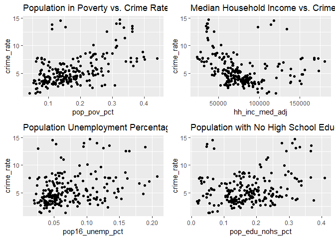
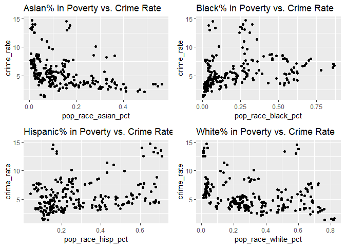

Siqing analysis
================
Siqing Wang
2023-12-02

Reading in the dataset that map each precinct to a neighborhood, for
further SES analysis

``` r
prec_neighbor = read_csv("data/nyc_prec_neighborhood.csv")
```

Reading in the SES data for demographics information for each
precinct/neighboorhood, and only keeping the relevant SES indicators

``` r
neighbor_ses = readxl::read_excel("data/neighorhood_indicators.xlsx", sheet = "Data") |> 
  janitor::clean_names() |> 
  filter(region_type == "Sub-Borough Area") |> 
  rename(neighborhood = region_name) |> 
  select(neighborhood, region_type, year, hh_inc_med_adj, pop16_unemp_pct, pop_edu_collp_pct, pop_edu_nohs_pct, pop_pov_pct, pop_num, pop_foreign_pct, pop_race_asian_pct, pop_race_black_pct, pop_race_hisp_pct, pop_race_white_pct) 
```

`neighbor_ses` df includes information on population, income,
umemployment, poverty, education, and racial factors for every
neighborhood.

Merging `prec_neighboor` with NYPD dataset, conducting more data
cleaning. The resulting `nypd_ses_df` only contains variables of
interest for SES analysis.

``` r
nypd_ses_df = df_nypd |> 
  rename(precinct = addr_pct_cd) |> 
  select(cmplnt_num, cmplnt_fr_dt, boro_nm, precinct, ofns_desc, pd_desc, law_cat_cd) |> 
  mutate(cmplnt_fr_dt = as.Date(cmplnt_fr_dt, format = "%m/%d/%Y"),
         year = format(cmplnt_fr_dt, "%Y")) |> 
  left_join(prec_neighbor, by = "precinct")
```

`nypd_ses_df` now contains neighboorhood information, as well as other
necessary data from the original master data

Now, calculate the crime rate for every precinct. Crime rate is
calculated by dividing the number of crimes committed per neighborhood
over the total population of that neighborhood, then times 100,000. Then
merge the crime rate data with other relevant socioeconomic data. We
focus only on the 2021 data.

``` r
ses_df = nypd_ses_df |> 
  group_by(year, neighborhood) |> 
  summarise(crime_num = n())

ses_df = ses_df |> merge(neighbor_ses, by = c("year", "neighborhood")) |> 
  na.omit() |> 
  mutate(crime_rate = (crime_num/pop_num) * 100,000)
```

`ses_df` contains crime rate and other SES data per neighborhood, by
year

Visualizing trend: are crime rates associated with poverty, income, and
educational level?

``` r
eda_plot1 = ses_df |> ggplot(aes(x = pop_pov_pct, y = crime_rate)) +
  geom_point() +  labs(title = "Population in Poverty vs. Crime Rate")

eda_plot2 = ses_df |> ggplot(aes(x = hh_inc_med_adj, y = crime_rate)) +
  geom_point() + labs(title = "Median Household Income vs. Crime Rate")

eda_plot3 = ses_df |> ggplot(aes(x = pop16_unemp_pct, y = crime_rate)) +
  geom_point() + labs(title = "Population Unemployment Percentage vs. Crime Rate")

eda_plot4 = ses_df |> ggplot(aes(x = pop_edu_nohs_pct, y = crime_rate)) +
  geom_point() + labs(title = "Population with No High School Education vs. Crime Rate")

gridExtra::grid.arrange(
  eda_plot1, eda_plot2, eda_plot3, eda_plot4, ncol = 2)
```

<!-- -->

Visualizing trend: are crime rates associated with racial factors?

``` r
eda_plot5 = ses_df |> ggplot(aes(x = pop_race_asian_pct, y = crime_rate)) +
  geom_point() +  labs(title = "Asian% in Poverty vs. Crime Rate")

eda_plot6 = ses_df |> ggplot(aes(x = pop_race_black_pct, y = crime_rate)) +
  geom_point() +  labs(title = "Black% in Poverty vs. Crime Rate")

eda_plot7 = ses_df |> ggplot(aes(x = pop_race_hisp_pct, y = crime_rate)) +
  geom_point() +  labs(title = "Hispanic% in Poverty vs. Crime Rate")

eda_plot8 = ses_df |> ggplot(aes(x = pop_race_white_pct, y = crime_rate)) +
  geom_point() +  labs(title = "White% in Poverty vs. Crime Rate")

gridExtra::grid.arrange(
  eda_plot5, eda_plot6, eda_plot7, eda_plot8, ncol = 2)
```

<!-- -->
