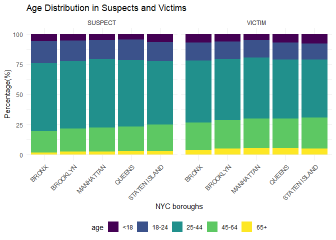

Suspect and Victim Analysis
================
Miao Fu
2023-11-25

## Demographic Distribution

We would like to learn more about the demographic information breakdown
in suspects and victims. The analysis is done through three aspects:
race, age, and sex. We divided the exploration into different boroughs
as it is a representative way of looking at NYC.

### race distribution across boroughs

<!-- -->

This figure shows the percentage of different race for all NYC boroughs.
Black, white, and white hispanic are the top three percent in both
suspects and victims across boroughs. The distribution of races is
similar between suspects and victims for each borough.

### age distribution across boroughs

<!-- -->

This figure shows the percentage of age group for suspect and victim in
all NYC boroughs. Majority of suspects and victims come from the age
group of 25-44. The distribution of age is similar between suspects and
victims for each borough as well as across boroughs.

### sex distribution across boroughs

<!-- -->

This figure shows the percentage of sex in suspects and victims for all
NYC boroughs. Around 75% of suspects are male and around 25% are female
for all boroughs. Around 70% of victims are female and around 30% are
male for all boroughs.

## Project Report paragaph

### Data

A subset of the master dataset was created specifically for demographic
distribution analysis by selecting the relevant variables. Rows with
missing values were dropped for data cleaning purpose. The demographic
dataset is further divided into suspects and victims datasets to
calculate the percentage of race, age and sex. Columns with incorrect
data values are further cleaned up. The demographic dataset has
following variables:

- `boro_nm`: NYC borough name  
- `susp_age_group`: Age group the suspect belongs to (\<18, 18-24,
  25-44, 45-64, 65+)  
- `susp_race`: Suspect race (AMERICAN INDIAN/ALASKAN NATIVE, ASIAN /
  PACIFIC ISLANDER, BLACK, BLACK HISPANIC, WHITE, WHITE HISPANIC)  
- `susp_sex`: Suspect sex (Female, Male)  
- `vic_age_group`: Age group the victim belongs to (\<18, 18-24, 25-44,
  45-64, 65+)  
- `vic_race`: Victim race (AMERICAN INDIAN/ALASKAN NATIVE, ASIAN /
  PACIFIC ISLANDER, BLACK, BLACK HISPANIC, WHITE, WHITE HISPANIC)  
- `vic_sex`: Victim sex (Female, Male)

### Exploratory analysis

Three barplots were created to visualize the distribution of race, age,
and sex in suspects and victims. Number of suspects and number of
victims are separately counted in each race, age, and sex groups.
Initially, count of suspects and victims in each race, age, and sex
groups were plotted. However, the different total population of each
borough made it difficult to directly visualize the distributions. Thus,
percentage of suspects and victims in each race, age, and sex groups
were calculated by dividing the count by total number of suspects or
victims in each borough.

### Discussion

It is interesting to see the distribution of race are quite similar
between suspects and victims. This suggests that the racial composition
of individuals involved as suspects or victims is consistent across the
dataset. The distribution of race are also similar between boroughs.
This suggests that there is no significant variation in the racial
demographics of incidents across different boroughs. The distribution of
age group are also similar between suspects and victims, as well as
across boroughs. This implies consistency in age demographics across
dataset and NYC boroughs. In combined, we observe consistency in the
race and age group distribution in suspects and victims in NYC crimes.
The distributions are uniform throughout the city, which was not
expected. The uniformity in demographic patterns may indicate systemic
factors influencing incidents rather than borough-specific or
role-specific(suspect vs victim) factors.  

On the other hand, the distribution of sex in suspects and victims show
significantly more male suspects than female suspects across all 7 NYC
boroughs. This suggests a consistent gender disparity among individuals
identified as suspects. Additionally, there are significantly more
female victims than male victims across all 7 NYC boroughs. In combined,
the data highlights a gender imbalance with a higher proportion of males
being identified as suspects and a higher proportion of females being
victims. The gender distribution is not surprising and confirms what we
expected. The observed gender disparities may suggests potential
sociological or systemic factors influencing crime reporting, law
enforcement, or victimization.
