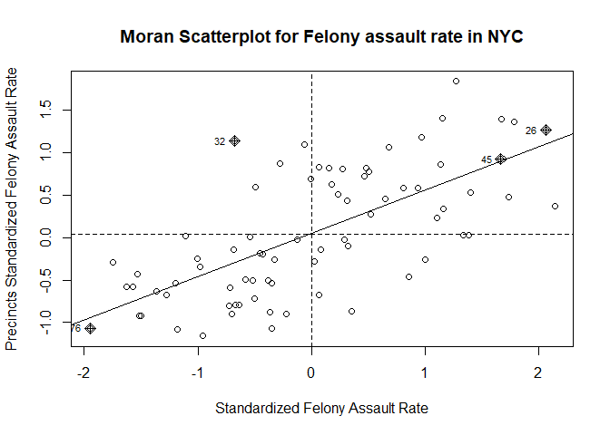
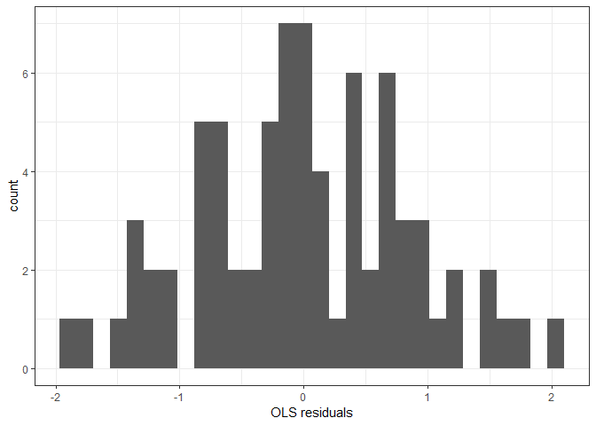
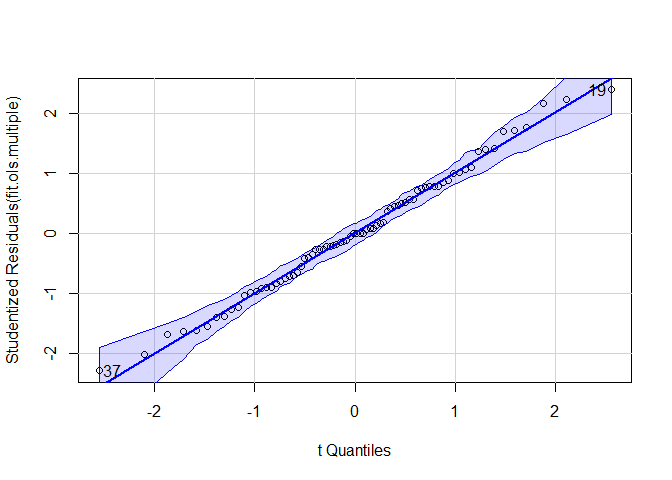

This analysis focuses on the proportion of serious crimes ("felony assault") and aims to investigate the socioeconomic factors associated with the higher rate of serious crimes. Again, we used 2021 NYPD crime complaint data and 2020 Census population data.   
The primary outcome (dependent variable: `fel_asslt_rate`) is the number of felony assault cases in each precinct divided by the total number of complaints in each precinct.  
NYC Open Data (2013) was used as spatial data to determine the borders of each precinct.


```r
# import and clean NYPD data
df_nypd = read_csv("https://www.dropbox.com/scl/fi/kf2zk4t1onxzm2vo3lpkq/NYPD_Complaint_Data_Historic.csv?rlkey=ly36vi9v66sno80eir6rohlwn&dl=1", na = "(null)") |> # some values are coded as "(null)" in the df; rewrite them as NA
  janitor::clean_names()

# precinct neighbor association
prec_neighbor = read_csv("data/nyc_prec_neighborhood.csv")


# merging neighborhood information with NYPD data, keep only relevant variables
nypd_ses_df = df_nypd |> 
  rename(precinct = addr_pct_cd) |> 
  mutate(cmplnt_fr_dt = as.Date(cmplnt_fr_dt, format = "%m/%d/%Y"),
         year = format(cmplnt_fr_dt, "%Y")) |> 
  left_join(prec_neighbor, by = "precinct") |> 
  filter(year == 2021) |> 
  select(precinct, ofns_desc, neighborhood, borough, longitude, latitude) |> 
  drop_na()

#Import and clean socio-economic data. neighbor_SES has SES indicators (except rent) for each neighborhood 
neighbor_ses = readxl::read_excel("data/neighorhood_indicators.xlsx", sheet = "Data") |> 
  janitor::clean_names() |> 
  filter(region_type == "Sub-Borough Area") |> 
  rename(neighborhood = region_name) |> 
  select(neighborhood, year, hh_inc_med_adj, pop16_unemp_pct, pop_edu_collp_pct, pop_pov_pct, pop_race_asian_pct, pop_race_black_pct, pop_race_hisp_pct, pop_race_white_pct, pop_foreign_pct) |> 
  filter(year == 2021) |> 
  mutate(
    pop16_unemp_pct = pop16_unemp_pct * 100, 
    pop_edu_collp_pct = pop_edu_collp_pct * 100, 
    pop_pov_pct = pop_pov_pct * 100,
    pop_race_asian_pct = pop_race_asian_pct * 100, 
    pop_race_black_pct = pop_race_black_pct * 100, 
    pop_race_white_pct = pop_race_white_pct * 100, 
    pop_race_hisp_pct = pop_race_hisp_pct * 100, 
    pop_foreign_pct = pop_foreign_pct * 100
  ) 

# NYC neighborhoods borders
nyc = read_sf(here::here("data", "Police_Precincts.geojson")) |> 
  select(-shape_area, -shape_leng) |> 
  mutate(
    precinct = as.double(precinct)
  )

# population data by precinct (2020 census, P1_001N: total population)
df_pop = read_csv(here::here("data", "nyc_precinct_2020pop.csv")) |> 
  rename(pop = P1_001N) |> 
  select(precinct, pop)

# merge with nypd dataset and calculate relevant indicators
nypd_ses_sda = nypd_ses_df |>  
  left_join(neighbor_ses, by = "neighborhood") |> # combine with ses data
  st_as_sf(
    # which columns to use as coordinates
    coords = c("longitude", "latitude"), 
    # keep the coordinate columns
    remove = FALSE,
    # projection system
    crs = 4326
  ) |> 
  merge(df_pop, by = "precinct") |> 
  group_by(precinct) |> 
  mutate(
    "fel_asslt_rate" = (sum(ofns_desc == "FELONY ASSAULT") / n()) * 100 # calculate "FELONY ASSAULT" rate among all crimes 
  ) |> 
  select(precinct, neighborhood, borough, pop, hh_inc_med_adj, pop16_unemp_pct, pop_edu_collp_pct, pop_pov_pct, geometry, fel_asslt_rate, pop_race_asian_pct, pop_race_black_pct, pop_race_white_pct, pop_race_hisp_pct, pop_foreign_pct) |> 
  ungroup()

# spatial join
df_spj = nypd_ses_sda |>
  # spatial join
  st_join(
    # only need these columns from nyc tibble
    nyc |> select(precinct, geometry),
    # join rows where there is some overlap between a dock and a precinct
    join = st_intersects,
    left = FALSE
  ) |> 
  select(-precinct.y) |> 
  rename(precinct = precinct.x)

count_by_precinct = df_spj |> 
  # remove geometry for fast counting
  st_drop_geometry() |> 
  distinct() |> 
  # join the counts into the nyc neighborhood object
  right_join(nyc, by=c("precinct" = "precinct")) |> 
  mutate(
    "pre_nei" = paste(precinct, "-", neighborhood, sep = " ") 
  ) |> 
  st_as_sf() |> 
  filter(precinct != 22) # remove central park data
```

We built the following three models and compered their performance.   
- **Standard linear regression**  
- **Spatial lag model (SLM)**  
- **Spatial error model (SEM)**   

The independent variables included in the models are as follows:  
- `pop`: the population in each precinct (we used `log(pop)` in the models)  
- `hh_inc_med_adj`: the median household's total income of all members of the household aged 15 years or older    
- `pop16_unemp_pct`: the number of people aged 16 years and older in the civilian labor force who are unemployed, divided by the total number of people aged 16 years and older in the civilian labor force  
- `pop_edu_collp_pct`: the percentage of the population aged 25 and older who have attained a bachelor's degree or higher  
- `pop_pov_pct`: the number of people below the poverty threshold divided by the number of people for whom poverty status was determined  
- `pop_race_asian_pct`: the percentage of the total population that identifies as Asian (non-Hispanic)  
- `pop_race_black_pct`: the percentage of the total population that identifies as black (non-Hispanic)  
- `pop_race_white_pct`: the percentage of the total population that identifies as white (non-Hispanic)  
- `pop_race_hisp_pct`: the percentage of the total population that identifies as Hispanic (of any race)  
- `pop_foreign_pct`: the share of the population that is born outside the United States or Puerto Rico   


```r
# simple linear regression
fit.ols.simple = lm(fel_asslt_rate ~ hh_inc_med_adj, data = count_by_precinct)

# multiple linear regression
fit.ols.multiple = lm(fel_asslt_rate ~ log(pop) + hh_inc_med_adj + pop16_unemp_pct + pop_edu_collp_pct + pop_pov_pct + pop_race_asian_pct + pop_race_black_pct + pop_race_white_pct + pop_race_hisp_pct + pop_foreign_pct, data = count_by_precinct)

# the neighbor nb object using poly2nb()
seab = poly2nb(count_by_precinct, queen = T)

# the listw weights object using nb2listw()
seaw = nb2listw(seab, style = "W", zero.policy = TRUE)

# Spatial lag model (SLM)
fit.lag = lagsarlm(fel_asslt_rate ~ log(pop) + hh_inc_med_adj + pop16_unemp_pct + pop_edu_collp_pct + pop_pov_pct + pop_race_asian_pct + pop_race_black_pct + pop_race_white_pct + pop_race_hisp_pct + pop_foreign_pct, data = count_by_precinct, listw = seaw) 

# get estimates of the direct, indirect and total effect of each variable
fit.lag.effects = impacts(fit.lag, listw = seaw, R = 999)

# Spatial error model (SEM)
fit.err = errorsarlm(fel_asslt_rate ~ log(pop) + hh_inc_med_adj + pop16_unemp_pct + pop_edu_collp_pct + pop_pov_pct + pop_race_asian_pct + pop_race_black_pct + pop_race_white_pct + pop_race_hisp_pct + pop_foreign_pct, data = count_by_precinct, listw = seaw) 
```

First, let's look at the histogram of the dependent variable. The distribution is unimodal and slightly right-skewed, but overall it is approximately normally distributed.

```r
# histogram
count_by_precinct |> 
  ggplot() +
    geom_histogram(aes(x = fel_asslt_rate)) +
    xlab("Felony assault rate")
```

<!-- -->

# Explaratory spatial data analysis  

```r
# ESDA
tmap_mode("plot")

tm_shape(count_by_precinct, unit = "mi") +
  tm_polygons(col = "fel_asslt_rate", style = "quantile", palette = "Reds", title = "") +
  tm_scale_bar(breaks = c(0, 2, 4), text.size = 1, position = c("right", "bottom")) +
  tm_layout(main.title = "Felony assault rate, 2021",  main.title.size = 0.95, frame = FALSE, legend.outside = TRUE, 
            attr.outside = TRUE)
```

<!-- -->


```r
# plot residuals
count_by_precinct = count_by_precinct |> 
  mutate(olsresid = resid(fit.ols.multiple))

tm_shape(count_by_precinct, unit = "mi") +
  tm_polygons(col = "olsresid", style = "quantile",palette = "Reds", title = "") +
  tm_scale_bar(breaks = c(0, 2, 4), text.size = 1, position = c("right", "bottom")) +
  tm_layout(main.title = "Residuals from linear regression",  main.title.size = 0.95, frame = FALSE, legend.outside = TRUE,
            attr.outside = TRUE)
```

<!-- -->

The spatial distribution of precincts with high felony crime rates and the residuals of the linear regression model are visualized. Spatial autocorrelation of errors is indicated as both maps appear to cluster.


```r
# examine the Moran scatterplot
moran.plot(as.numeric(scale(count_by_precinct$fel_asslt_rate)), listw = seaw, 
           xlab = "Standardized Felony Assault Rate", 
           ylab = "Precincts Standardized Felony Assault Rate",
           main = c("Moran Scatterplot for Felony assault rate in NYC"))
```

<!-- -->

The Moran scatter plot displays the positive relationship between the standardized felony assault rate and precincts standardized felony assault rate. 


```r
# the Global Moran’s I
# use Monte Carlo simulation to get the p-value
moran.mc(count_by_precinct$fel_asslt_rate, seaw, nsim=999) |> 
  broom::tidy() |> 
  knitr::kable()
```


| statistic| p.value| parameter|method                            |alternative |
|---------:|-------:|---------:|:---------------------------------|:-----------|
| 0.5097451|   0.001|      1000|Monte-Carlo simulation of Moran I |greater     |

```r
# repeat for the OLS residuals using the lm.morantest() function
lm.morantest(fit.ols.multiple, seaw) |> 
  broom::tidy() |> 
  knitr::kable()
```


| estimate1| estimate2| estimate3|  statistic|   p.value|method                                  |alternative |
|---------:|---------:|---------:|----------:|---------:|:---------------------------------------|:-----------|
| -0.115526| -0.082871| 0.0056489| -0.4344796| 0.6680299|Global Moran I for regression residuals |greater     |

The Moran I test indicates that there is a positive spatial autocorrelation for the felony assault rate, but no spatial autocorrelation for the linear regression residuals.

# Compare three models 


```r
# present results for more than one model
stargazer(fit.ols.multiple, fit.lag, fit.err, type = "html", digits = 3, title = "Regression Results")
```


<table style="text-align:center"><caption><strong>Regression Results</strong></caption>
<tr><td colspan="4" style="border-bottom: 1px solid black"></td></tr><tr><td style="text-align:left"></td><td colspan="3"><em>Dependent variable:</em></td></tr>
<tr><td></td><td colspan="3" style="border-bottom: 1px solid black"></td></tr>
<tr><td style="text-align:left"></td><td colspan="3">fel_asslt_rate</td></tr>
<tr><td style="text-align:left"></td><td><em>OLS</em></td><td><em>spatial</em></td><td><em>spatial</em></td></tr>
<tr><td style="text-align:left"></td><td><em></em></td><td><em>autoregressive</em></td><td><em>error</em></td></tr>
<tr><td style="text-align:left"></td><td>(1)</td><td>(2)</td><td>(3)</td></tr>
<tr><td colspan="4" style="border-bottom: 1px solid black"></td></tr><tr><td style="text-align:left">log(pop)</td><td>-0.150</td><td>-0.150</td><td>-0.192</td></tr>
<tr><td style="text-align:left"></td><td>(0.336)</td><td>(0.310)</td><td>(0.283)</td></tr>
<tr><td style="text-align:left"></td><td></td><td></td><td></td></tr>
<tr><td style="text-align:left">hh_inc_med_adj</td><td>0.00001</td><td>0.00001</td><td>0.00001</td></tr>
<tr><td style="text-align:left"></td><td>(0.00001)</td><td>(0.00001)</td><td>(0.00001)</td></tr>
<tr><td style="text-align:left"></td><td></td><td></td><td></td></tr>
<tr><td style="text-align:left">pop16_unemp_pct</td><td>-0.007</td><td>-0.002</td><td>-0.006</td></tr>
<tr><td style="text-align:left"></td><td>(0.059)</td><td>(0.055)</td><td>(0.049)</td></tr>
<tr><td style="text-align:left"></td><td></td><td></td><td></td></tr>
<tr><td style="text-align:left">pop_edu_collp_pct</td><td>0.0005</td><td>0.001</td><td>0.002</td></tr>
<tr><td style="text-align:left"></td><td>(0.015)</td><td>(0.013)</td><td>(0.011)</td></tr>
<tr><td style="text-align:left"></td><td></td><td></td><td></td></tr>
<tr><td style="text-align:left">pop_pov_pct</td><td>0.089<sup>**</sup></td><td>0.090<sup>***</sup></td><td>0.099<sup>***</sup></td></tr>
<tr><td style="text-align:left"></td><td>(0.036)</td><td>(0.033)</td><td>(0.028)</td></tr>
<tr><td style="text-align:left"></td><td></td><td></td><td></td></tr>
<tr><td style="text-align:left">pop_race_asian_pct</td><td>-0.102<sup>*</sup></td><td>-0.107<sup>**</sup></td><td>-0.108<sup>**</sup></td></tr>
<tr><td style="text-align:left"></td><td>(0.055)</td><td>(0.052)</td><td>(0.044)</td></tr>
<tr><td style="text-align:left"></td><td></td><td></td><td></td></tr>
<tr><td style="text-align:left">pop_race_black_pct</td><td>-0.033</td><td>-0.036</td><td>-0.044</td></tr>
<tr><td style="text-align:left"></td><td>(0.056)</td><td>(0.052)</td><td>(0.045)</td></tr>
<tr><td style="text-align:left"></td><td></td><td></td><td></td></tr>
<tr><td style="text-align:left">pop_race_white_pct</td><td>-0.078</td><td>-0.082<sup>*</sup></td><td>-0.091<sup>**</sup></td></tr>
<tr><td style="text-align:left"></td><td>(0.052)</td><td>(0.048)</td><td>(0.042)</td></tr>
<tr><td style="text-align:left"></td><td></td><td></td><td></td></tr>
<tr><td style="text-align:left">pop_race_hisp_pct</td><td>-0.053</td><td>-0.056</td><td>-0.063</td></tr>
<tr><td style="text-align:left"></td><td>(0.050)</td><td>(0.046)</td><td>(0.040)</td></tr>
<tr><td style="text-align:left"></td><td></td><td></td><td></td></tr>
<tr><td style="text-align:left">pop_foreign_pct</td><td>0.031<sup>*</sup></td><td>0.031<sup>*</sup></td><td>0.033<sup>**</sup></td></tr>
<tr><td style="text-align:left"></td><td>(0.017)</td><td>(0.016)</td><td>(0.014)</td></tr>
<tr><td style="text-align:left"></td><td></td><td></td><td></td></tr>
<tr><td style="text-align:left">Constant</td><td>9.499</td><td>10.060<sup>*</sup></td><td>10.531<sup>*</sup></td></tr>
<tr><td style="text-align:left"></td><td>(6.510)</td><td>(6.077)</td><td>(5.414)</td></tr>
<tr><td style="text-align:left"></td><td></td><td></td><td></td></tr>
<tr><td colspan="4" style="border-bottom: 1px solid black"></td></tr><tr><td style="text-align:left">Observations</td><td>76</td><td>76</td><td>76</td></tr>
<tr><td style="text-align:left">R<sup>2</sup></td><td>0.761</td><td></td><td></td></tr>
<tr><td style="text-align:left">Adjusted R<sup>2</sup></td><td>0.724</td><td></td><td></td></tr>
<tr><td style="text-align:left">Log Likelihood</td><td></td><td>-95.441</td><td>-93.988</td></tr>
<tr><td style="text-align:left">sigma<sup>2</sup></td><td></td><td>0.721</td><td>0.674</td></tr>
<tr><td style="text-align:left">Akaike Inf. Crit.</td><td></td><td>216.882</td><td>213.976</td></tr>
<tr><td style="text-align:left">Residual Std. Error</td><td>0.920 (df = 65)</td><td></td><td></td></tr>
<tr><td style="text-align:left">F Statistic</td><td>20.697<sup>***</sup> (df = 10; 65)</td><td></td><td></td></tr>
<tr><td style="text-align:left">Wald Test (df = 1)</td><td></td><td>0.287</td><td>4.691<sup>**</sup></td></tr>
<tr><td style="text-align:left">LR Test (df = 1)</td><td></td><td>0.250</td><td>3.156<sup>*</sup></td></tr>
<tr><td colspan="4" style="border-bottom: 1px solid black"></td></tr><tr><td style="text-align:left"><em>Note:</em></td><td colspan="3" style="text-align:right"><sup>*</sup>p<0.1; <sup>**</sup>p<0.05; <sup>***</sup>p<0.01</td></tr>
</table>


```r
# save AIC values
AICs = c(AIC(fit.ols.multiple),AIC(fit.lag), AIC(fit.err))
labels = c("Standard Linear Regression", "Spatial Lag Model","Spatial Error Model" )

data.frame(Models = labels, AIC = round(AICs, 2)) |> 
  knitr::kable() 
```


|Models                     |    AIC|
|:--------------------------|------:|
|Standard Linear Regression | 215.13|
|Spatial Lag Model          | 216.88|
|Spatial Error Model        | 213.98|
The Akaike Information Criterion (AIC) values across the three models suggest that the spatial error model (SEM) is the best fit of the three models. Despite the absence of global spatial autocorrelation in the linear regression residuals, the SEM model exhibited superior performance compared to the other two models. This may be attributed to potential local spatial patterns of heterogeneity that were captured by the spatial error model. 

The coefficients of `pop_pov_pct`, `pop_race_asian_pct`, `pop_race_white_pct` and `pop_foreign_pct` were statistically significant in the spatial error model.  

## Linear regression diagnostics

```r
# diagnostics
ggplot() + 
  geom_histogram(mapping = aes(x=resid(fit.ols.multiple))) +
  xlab("OLS residuals")
```

<!-- -->

```r
qqPlot(fit.ols.multiple)
```

<!-- -->

```
## [1] 19 37
```

```r
plot(resid(fit.ols.multiple))
```

<!-- -->

OLS residuals are normally distributed and Q-Q plot also indicates that the normality assumption is met in this model. There may be heteroskedasticity according to the third plot, where the points are narrowing as the index moves from left to right.

# Conclusion
The spatial error model demonstrated a superior fit, revealing that factors such as the poverty rate, the percentage of Asian and White populations, and the percentage of individuals born outside the US or Puerto Rico were significant predictors for severe crime rates.

# References 
- NYPD (2023, June 16). NYPD Complaint Data Historic: NYC Open Data. [Link](https://data.cityofnewyork.us/Public-Safety/NYPD-Complaint-Data-Historic/qgea-i56i)
- CoreData.nyc. Subsidized Housing Database. NYU Furman Center’s CoreData.nyc. [Link](https://furmancenter.org/coredata/userguide/about)
- Bureau, U. C. (2022, November 29). 2020 census. Census.gov. [Link](https://www.census.gov/programs-surveys/decennial-census/decade/2020/2020-census-main.html)
- Department of City Planning (DCP) (2013, Jan 29). NYC Open Data. [Link](https://data.cityofnewyork.us/Public-Safety/Police-Precincts/78dh-3ptz)


