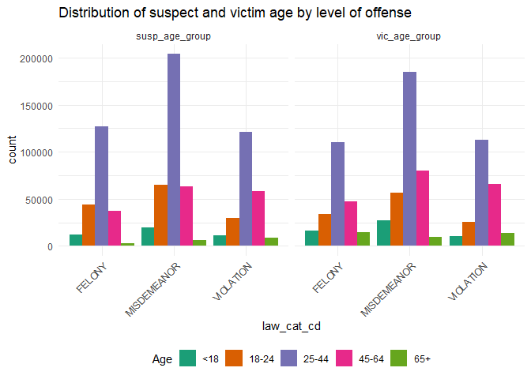
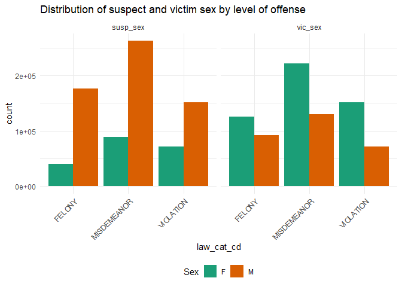

suspect_victim_correlations
================
Nihaal Rahman

## Demographic Distribution

The following queries are exploring the demographic information
breakdown in suspects and victims by the severity of the crime reported.
Using the crime levels of violation, misdemeanor, and felony, these
charts visualize the counts of suspects/victims by race, age, and sex,
respectively.

\###Looking at suspect/victim race by level of offense

``` r
race_combined <- gather(data, key = "variable", value = "race", susp_race, vic_race)

race_plot <- ggplot(race_combined, aes(x = law_cat_cd, fill = race)) +
  geom_bar(position = "dodge") +
  labs(title = "Distribution of supect and victim race by level of offense") +
  guides(fill = guide_legend(title = "Race")) +
  facet_wrap(~variable, scales = "free_x", ncol = 2) +
  theme_minimal()+
  scale_fill_brewer(palette = "Dark2")+
  theme(axis.text.x=element_text(angle=45,hjust=1),legend.position="bottom")

print(race_plot)
```

<!-- -->

Looking at this chart, we can see that black individuals have the
highest counts across all crimes for both suspects and victims. In both
charts, white Hispanic individuals make up the 2nd highest count, and
then white individuals make up the 3rd. For suspects, black Hispanic
individuals make up the 4th highest count, but Asian/Pacific Islander
make up the 4th highest count of victims.

\###Looking at suspect/victim age by level of offense

``` r
age_combined <- gather(data, key = "variable", value = "age", susp_age_group, vic_age_group)

age_plot <- data |> 
  filter(susp_age_group %in% c('<18', '18-24', '25-44', '45-64', '65+') & vic_age_group %in% c('<18', '18-24', '25-44', '45-64', '65+')) |> 
  gather(key = "variable", value = "age", susp_age_group, vic_age_group) |> 
  ggplot(aes(x = law_cat_cd, fill = age)) +
  geom_bar(position = "dodge") +
  labs(title = "Distribution of suspect and victim age by level of offense") +
  guides(fill = guide_legend(title = "Age")) +
  facet_wrap(~variable, scales = "free_x", ncol = 2) +
  theme_minimal()+
  scale_fill_brewer(palette = "Dark2")+
  theme(axis.text.x=element_text(angle=45,hjust=1),legend.position="bottom")

print(age_plot)
```

<!-- -->

In this chart we see that the 25-44 age group is the most populous for
both suspects and victims across all levels of crime. Interestingly, the
18-24 group is the 2nd greatest for felony suspects, the 45-64 group is
the 2nd highest for violation suspects, and both are relatively equal
for misdemeanor suspects. Among the victims, 45-64 are consistently the
2nd highest, with 18-24 following them.

\###Looking at suspect/victim sex by level of offense

``` r
sex_combined <- gather(data, key = "variable", value = "sex", susp_sex, vic_sex)

sex_plot <- data |> 
  filter(susp_sex %in% c('F', 'M') & vic_sex %in% c('F', 'M')) |> 
  gather(key = "variable", value = "sex", susp_sex, vic_sex) |> 
  ggplot(aes(x = law_cat_cd, fill = sex)) +
  geom_bar(position = "dodge") +
  labs(title = "Distribution of suspect and victim sex by level of offense") +
  guides(fill = guide_legend(title = "Sex")) +
  facet_wrap(~variable, scales = "free_x", ncol = 2) +
  theme_minimal()+
  scale_fill_brewer(palette = "Dark2")+
  theme(axis.text.x=element_text(angle=45,hjust=1),legend.position="bottom")

print(sex_plot)
```

<!-- -->

In this chart we see that women make up a greater number of victims,
while men make up a greater number of suspects. However, the disparity
between sexes is smaller among the victims than it is among the
suspects.

Throughout our public health education, we have learned about the
importance of intersectionality. While these snapshots give us
information about key demographic identities, we may be missing some
kind of bigger picture. So, now we will investigate which combinations
of identities are the most prevalent among the suspects and victims.

\###Seeing the top 5 combinations of race+age+sex for both victim and
suspect counts

| vic_age_group | vic_race       | vic_sex |  count |
|:--------------|:---------------|:--------|-------:|
| 25-44         | BLACK          | F       | 116922 |
| 25-44         | WHITE HISPANIC | F       |  75828 |
| 25-44         | BLACK          | M       |  48217 |
| 45-64         | BLACK          | F       |  46294 |
| 25-44         | WHITE          | F       |  39104 |

| susp_age_group | susp_race      | susp_sex |  count |
|:---------------|:---------------|:---------|-------:|
| 25-44          | BLACK          | M        | 161899 |
| 25-44          | WHITE HISPANIC | M        |  84750 |
| 25-44          | BLACK          | F        |  55501 |
| 45-64          | BLACK          | M        |  52222 |
| 18-24          | BLACK          | M        |  50762 |

After creating these tables, we are able to see that black women between
the ages of 25-44 make up the highest count of victims, and black men
between the ages of 25-44 make up the highest count of suspects.
Policies targeted towards reducing crime and protecting civilians should
take into consideration the unique socio-ecological factors surrounding
these groups.
